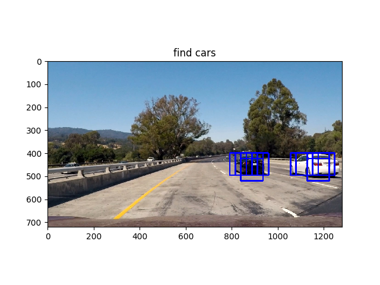
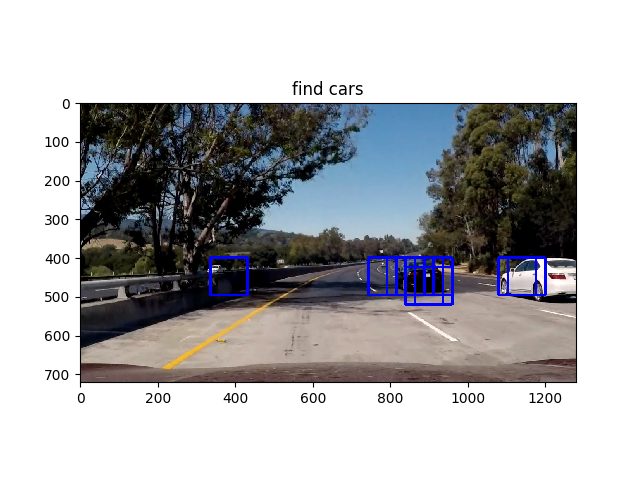
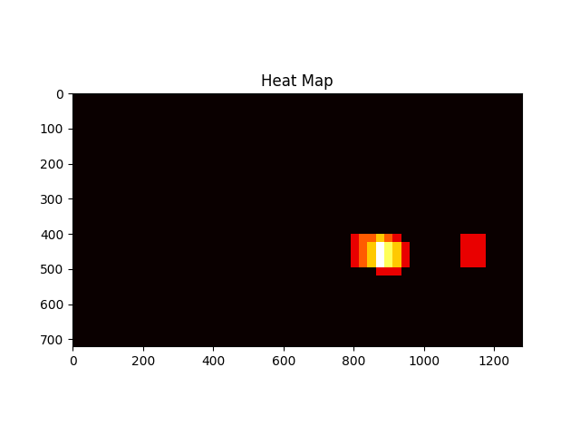
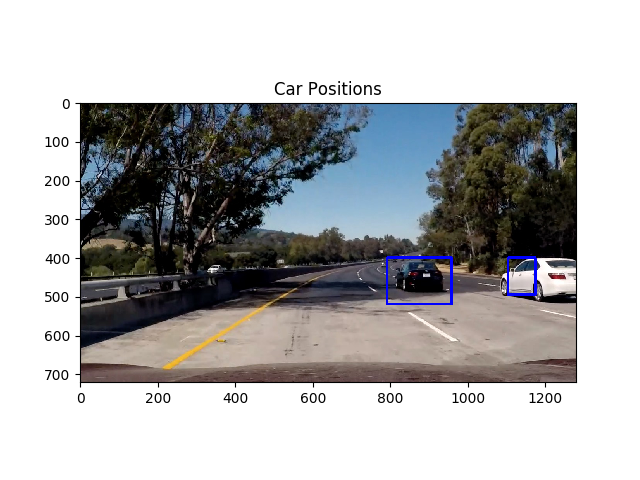

# Vehicle Detection
[](http://www.udacity.com/drive)

## The Project
Identify and highlight videos in a video.

The main files of the project and what they were used for:
* [search_and_classify.py](search_and_classify.py) - extract the features based on certain parameters and then classify using SVM.
* [utils.py](utils.py) - miscellaneous funcs that I use throughout the project that do things like: extract features, sliding window search, etc.
* [pipeline.py](pipelie.py) - the main pipeline function that takes an image, searches for the cars, and returns an image with bounding boxes around the cars drawn
* [movie.py](movie.py) - running the pipeline against the video and outputting the result of this project

## Histogram of Oriented Gradients (HOG)
The parameters for feature extraction are in [search_and_classify.py](search_and_classify.py) lines 23-33. I've also outlined the parameters here:

| Param         | Value         |
| ------------- |:-------------:|
| color_space |YCrCb |
| orient |9 |
| pix_per_cell |8 |
| cell_per_block|2 |

I found that through trial and error, that these parameters gave the best results and gave the least false posives.

The HOG features plus the spatial and color features were classified using SVM in [search_and_classify.py](search_and_classify.py) lines 80-87. Prior to classification data was sclaed to zero mean and unit variance:

```python
X_scaler = StandardScaler().fit(X)
```

## Sliding Window Search
The sliding window search can be found in [utils.py](utils.py) in the `find_cars` function.

**How did you find the scales to search and how much to overlap?**

Here is an image demonstrating the search:



## Video Implementation
The resulting video is [vehicle_detection.mp4](vehicle_detection.mp4).

To eliminate false positives, I limited the search to a certain boundary of the image where the cars are more likely to show up (not in the air or around the hood). I also implemented a 'heat map' to eliminate false positives. The heat map eliminated possibilities that didn't have many bounding boxes.

Here's a visualization of how the heat map helped filter a false positive in this case:


the resulting heat map:


the result of using the heat map to filter false positives:



## Discussion
